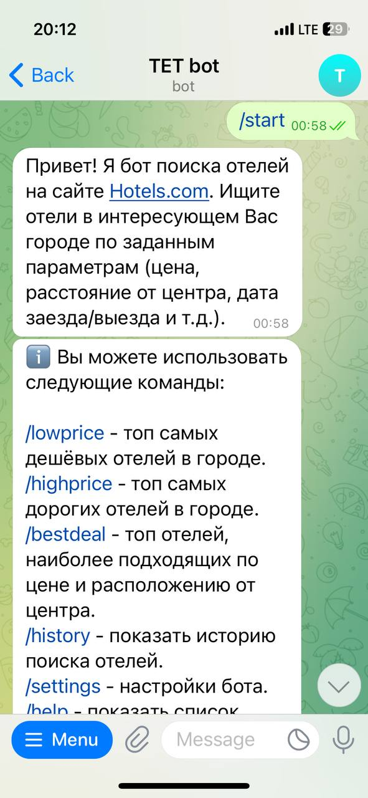
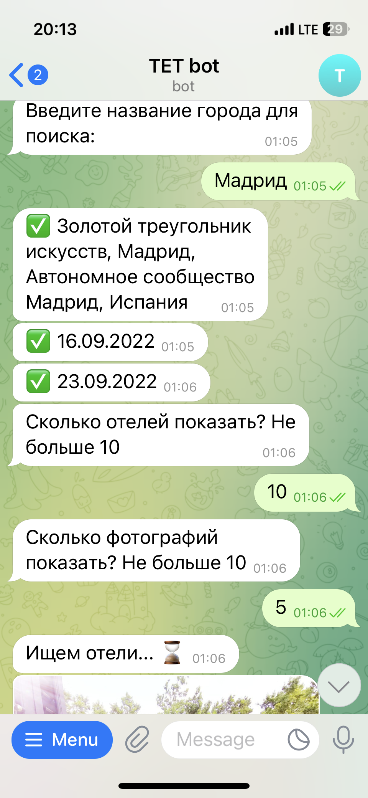
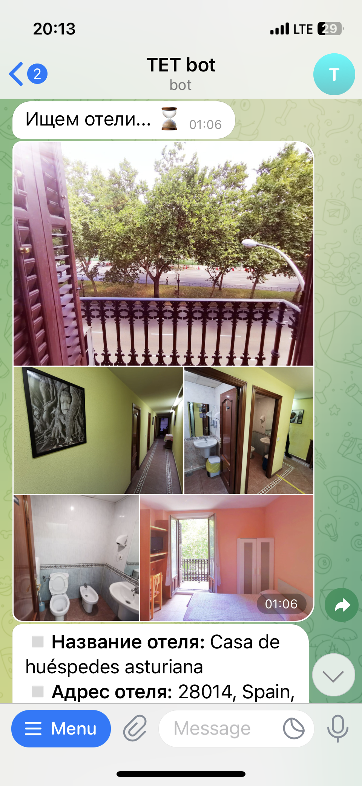
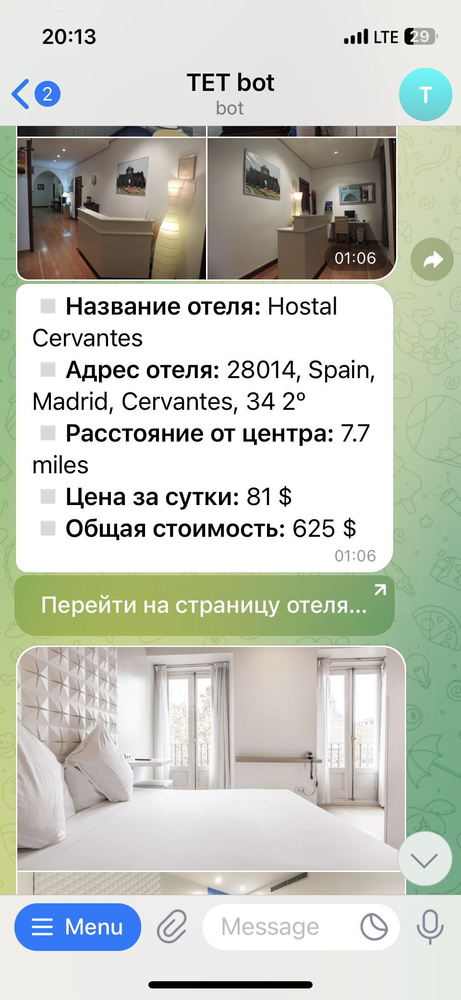

# Телеграм-бот для поиска отелей

## Цель проекта
Разработка телеграм-бота на Python для поиска отелей на сайте hotels.com.

### В рамках проекта выполнены следующие задачи:

- разработка структуры приложения
- реализация запросов к api hotels4.p.rapidapi.com) с помощью библиотеки requests
- реализация пользовательского интерфейса с помощью библиотеки PyTelegramBotApi

### Стек технологий:

- PyTelegramBotApi
- Requests
- SqLite

## Результат:
Разработано приложение с функционалом по поиску отелей и взаимодействующие 
с пользователем по средствам телеграм-бота.

**Примеры использования:**

